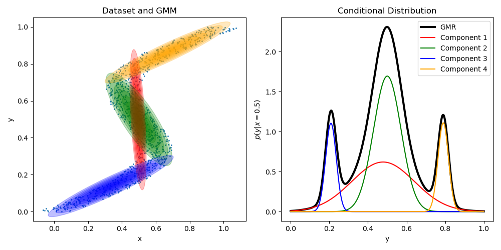
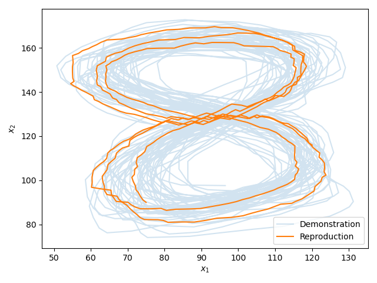

# Summary

gmr is a Python library for Gausian mixture regression (GMR). GMR is a
regression approach that models probability distributions rather than
functions. Hence, it is possible to model multimodal mappings.

In GMR we first learn a joint probability distribution
$p(\boldsymbol{x}, \boldsymbol{y})$ of input $\boldsymbol{x}$ and output
$\boldsymbol{y}$ through expectation maximization [@Dempster1977] and then
compute the conditional distribution $p(\boldsymbol{y}|\boldsymbol{x})$
to make predictions. Thus, training is the same procedure as in a standard
Gaussian mixture model (GMM).

# Statement of Need

The library gmr is fully compatible with scikit-learn [@Pedregosa2011]. It
has its own implementation of expectation maximization (EM), but it can also
be initialized with a GMM from sklearn, which means that we can also initialize
it from a Bayesian GMM of scikit-learn. The prediction process for regression
is not available in scikit-learn and, thus, will be provided by gmr.

The library gmr provides a simple interface and several useful features to
deal with multimodal regression, mixtures of Gaussians, and multivariate
Gaussian distributions:

* EM implementation that only requires numpy and scipy
* computation of conditional distributions
* sampling from confidence regions of multivariate Gaussians
* collapsing a GMM to a single Gaussian
* extraction of individual Gaussians from a (conditional) GMM
* plotting of covariance ellipses
* unscented transform [@Uhlmann1995] to estimate the effect of a nonlinear
  function on a Gaussian distribution

# Background

Gaussian mixture regression via EM has been proposed first by @Ghahramani1994.
@Calinon2007 introduced the term Gaussian mixture regression in the context of
imitation learning for trajectories of robots and many publications that use
GMR in this domain followed. @Stulp2015 present Gaussian mixture regression in
a more recent survey.

## Training

During the training phase we learn a Gaussian mixture model

$$p(\boldsymbol{x}, \boldsymbol{y}) =
    \sum_{k=1}^K \pi_k
    \mathcal{N}_k(\boldsymbol{x}, \boldsymbol{y}|
                  {\boldsymbol{\mu}_{\boldsymbol{x}\boldsymbol{y}}}_k,
                  {\boldsymbol{\Sigma}_{\boldsymbol{x}\boldsymbol{y}}}_k)$$

through EM, where
$\mathcal{N}_k(\boldsymbol{x}, \boldsymbol{y}|{\boldsymbol{\mu}_{\boldsymbol{x}\boldsymbol{y}}}_k,
{\boldsymbol{\Sigma}_{\boldsymbol{x}\boldsymbol{y}}}_k)$
are Gaussian distributions with mean
${\boldsymbol{\mu}_{\boldsymbol{x}\boldsymbol{y}}}_k$ and covariance
${\boldsymbol{\Sigma}_{\boldsymbol{x}\boldsymbol{y}}}_k$, $K$ is the number of
Gaussians, and $\pi_k \in \left[0, 1\right]$ are priors that sum up to one.

## Prediction

Gaussian mixture regression can be used to predict distributions of variables
$\boldsymbol{y}$ by computing the conditional distribution
$p(\boldsymbol{y} | \boldsymbol{x})$. The conditional distribution of each
individual Gaussian
$$\mathcal{N}(\boldsymbol{x}, \boldsymbol{y}|{\boldsymbol{\mu}_{\boldsymbol{x}\boldsymbol{y}}},
{\boldsymbol{\Sigma}_{\boldsymbol{x}\boldsymbol{y}}})$$
$$\boldsymbol{\mu}_{\boldsymbol{x}\boldsymbol{y}}
    = \left(\begin{array}{c}\boldsymbol{\mu}_{\boldsymbol{x}}\\\boldsymbol{\mu}_{\boldsymbol{y}}\end{array}\right),
\quad
\boldsymbol{\Sigma}_{\boldsymbol{x}\boldsymbol{y}}
    = \left(\begin{array}{cc}
        \boldsymbol{\Sigma}_{\boldsymbol{x}\boldsymbol{x}} & \boldsymbol{\Sigma}_{\boldsymbol{x}\boldsymbol{y}}\\
        \boldsymbol{\Sigma}_{\boldsymbol{y}\boldsymbol{x}} & \boldsymbol{\Sigma}_{\boldsymbol{y}\boldsymbol{y}}\end{array}\right)$$
is defined by
$$\boldsymbol{\mu}_{\boldsymbol{y}|\boldsymbol{x}}
    = \boldsymbol{\mu}_{\boldsymbol{y}} + \boldsymbol{\Sigma}_{\boldsymbol{y}\boldsymbol{x}} \boldsymbol{\Sigma}_{\boldsymbol{x}\boldsymbol{x}}^{-1}(\boldsymbol{x} - \boldsymbol{\mu}_{\boldsymbol{x}})$$
$$\boldsymbol{\Sigma}_{\boldsymbol{y} | \boldsymbol{x}}
    = \boldsymbol{\Sigma}_{\boldsymbol{y}\boldsymbol{y}} - \boldsymbol{\Sigma}_{\boldsymbol{y}\boldsymbol{x}} \boldsymbol{\Sigma}_{\boldsymbol{x}\boldsymbol{x}}^{-1} \boldsymbol{\Sigma}_{\boldsymbol{x}\boldsymbol{y}}.$$
In a Gaussian mixture model we compute the conditional distribution of each
individual Gaussian and their priors
$${\pi_{\boldsymbol{y}|\boldsymbol{x}}}_k =
\frac{
\mathcal{N}_k(\boldsymbol{x}|{\boldsymbol{\mu}_{\boldsymbol{x}}}_k,
                             {\boldsymbol{\Sigma}_{\boldsymbol{x}}}_k)
}{
\sum_{l=1}^{K}
\mathcal{N}_{l}(\boldsymbol{x}|{\boldsymbol{\mu}_{\boldsymbol{x}}}_{l},
                             {\boldsymbol{\Sigma}_{\boldsymbol{x}}}_{l})
}$$
to obtain the conditional distribution
$$p(\boldsymbol{y}|\boldsymbol{x}) =
    \sum_{k=1}^K {\pi_{\boldsymbol{y}|\boldsymbol{x}}}_k
    \mathcal{N}_k(\boldsymbol{y}|
                  {\boldsymbol{\mu}_{\boldsymbol{y}|\boldsymbol{x}}}_k,
                  {\boldsymbol{\Sigma}_{\boldsymbol{y}|\boldsymbol{x}}}_k).$$

# Examples

Here is an example of a dataset where multiple outputs $\boldsymbol{y}$ are
valid predictions for one input $\boldsymbol{x}$.

On the left side of Figure \autoref{fig:multimodal_regression} you see the
training data and the fitted GMM indicated by ellipses corresponding to its
components. On the right side you see the predicted probability density
$p(\boldsymbol{y}|\boldsymbol{x}=0.5)$. There are three peaks that correspond
to three different valid predictions. Each peak is represented by at least one
of the Gaussians of the GMM.

We can use GMR to represent demonstrated motions. Here is a example in 2D, in
which we have a dataset that is a sequence of positions $\boldsymbol{x}$ and
corresponding velocities $\dot{\boldsymbol{x}}$. We train a GMM to represent
$p(\boldsymbol{x}, \dot{\boldsymbol{x}})$. Then we can generate a new
trajectory by iteratively sampling
$\dot{\boldsymbol{x}}_t \sim p(\dot{\boldsymbol{x}}|\boldsymbol{x}=\boldsymbol{x}_t)$
and computing the next position as
$\boldsymbol{x}_{t+1} = \boldsymbol{x}_t + \Delta t \dot{\boldsymbol{x}}_t$.

In Figure \autoref{fig:imitation_learning} we can see that in the middle of
the eight we have multiple modes: one velocity vector would lead to the left
and one to the right. Sampling from the conditional GMM is only one possible
solution here. Another one would be to select the component that contributes
the most to the probability density and take its mean. When we sample, we
often want to ensure that we do not end up in a region of low probability.
Hence, we can resample as long as we are not in an $\alpha$-confidence region,
where $\alpha \in \left[0, 1\right]$. This strategy is used here and is
directly provided by the library.

# References
